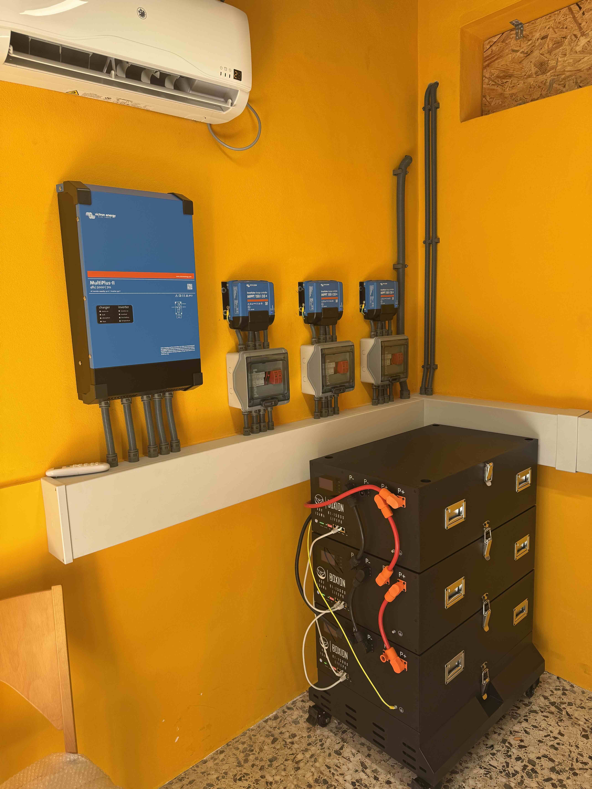
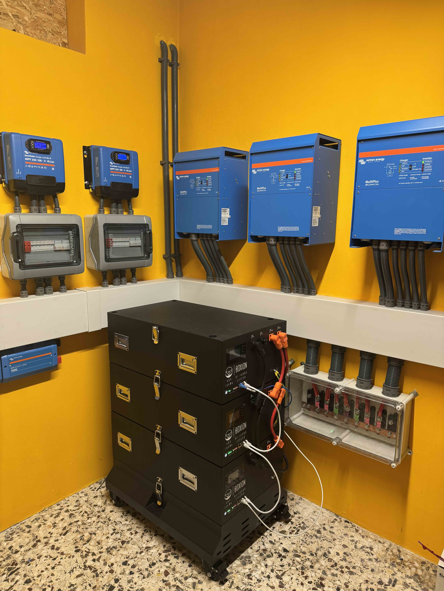
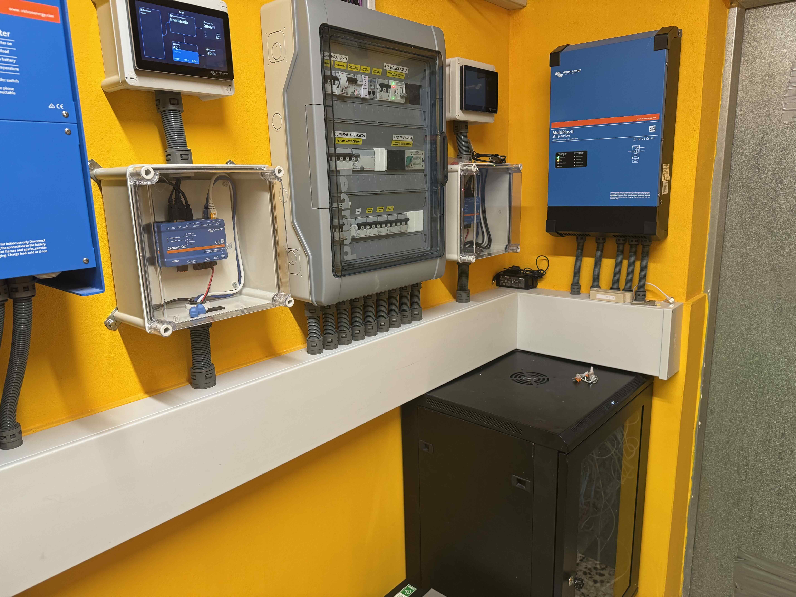

# ha-victron-ess-control

Custom integration for Victron Energy ESS systems in Home Assistant. Provides guided setup (config flow), the helper/sensor package, and 9 automation blueprints — all deployed automatically on install.

> **Dashboard views** are in the companion repo **[ha-victron-ess-frontend](https://github.com/marisma-mhe/ha-victron-ess-frontend)** — copy the YAML panels into your Lovelace dashboards after setup.

## Background

The Victron ESS out of the box offers limited flexibility for dynamic feed-in and charging control. This integration was built to fill that gap.

**The installation it was developed on:**

- **Grid connection:** Single-phase only (one phase from the grid provider)
- **Grid-side inverters:** Master/Slave MultiPlus 48/5000/70-x — handles grid charging and feed-in for the single-phase connection
- **House installation:** Three-phase setup with 3× MultiPlus 48/5000/70-100
- **Solar:** 36 panels
- **Battery:** 6× 16.6 kWh Boxion batteries (Solar Electrical System) — ~100 kWh total

The system is largely off-grid capable, but during extended bad weather the grid connection is needed for overnight top-up charging.

**The problem this solves:**

Grid providers in Spain disconnect installations that feed in too aggressively or raise voltage too much on the local network. To stay within limits while still maximising self-consumption economics, the feed-in logic was tuned to:

- Start exporting early in the day, as grid voltage is typically low in the morning
- Back off export power gradually as grid voltage rises (voltage-curve control)
- Apply a conservative default upper voltage threshold — configurable up to 252 V at the user's own risk
- Always reserve enough battery capacity for overnight consumption

The result is a near-zero electricity bill: any excess is exported to the grid (or virtual cloud storage), and the overnight charging automation covers the rare cases where solar alone is insufficient. Overnight charging runs between 00:00 and 08:00 at the lowest available tariff (Octopus Energy Spain).

This setup and logic is generalised in the blueprints so it works for any Victron ESS installation — single-phase, three-phase, or dual-system.





## What This Repo Provides

- **Guided setup wizard** — config flow collects serials, battery capacity; deploys the package with values filled in
- **Helper + sensor package** (`packages/victron_ess.yaml`) — all `input_*` helpers, canonical `sensor.victron_ess_*` template sensors, utility meters
- **9 automation blueprints** — deployed automatically to `blueprints/automation/victron/` on setup
- **Manual installation path** — package file can be used standalone without the integration

## Requirements

### Required

| Dependency | Notes |
|---|---|
| **Home Assistant 2024.6+** | Packages mechanism + blueprint input selectors |
| **HA MQTT Integration** | Must be configured and connected to the same broker as the Victron GX device |
| **[ha-victron-mqtt](https://github.com/tomer-w/ha-victron-mqtt)** (HACS) | Provides all `sensor.victron_mqtt_<serial>_*` entities. The serial shown in HA → Settings → Devices for your GX device goes into `input_text.victron_grid_system_id`. |

### Optional (graceful fallback if missing)

| Dependency | Used by | Fallback |
|---|---|---|
| **[Solcast Solar](https://github.com/BJReplay/ha-solcast-solar)** (HACS) | Overnight charging, feed-in control | Falls back to static helper values |
| Entities: `sensor.solcast_weighted_remaining_today_kwh`, `sensor.solcast_weighted_remaining_tomorrow_kwh` | — | Must match these exact entity IDs (Solcast default) |
| Any `weather.*` entity | Storm forecast fetch | Blueprint input — use any weather provider |
| `binary_sensor.storm_rain_active` | Storm auto-control | Without this, storm mode is only triggered via forecast, not live rain detection |

## Supported Topologies

**Single system** — one GX device handles grid, battery, and all loads. Set `victron_grid_system_id` and `victron_consumer_system_id` to the same serial.

**Dual system** — separate GX devices for the grid-side ESS (1-phase or 3-phase grid meter) and a consumer-side system (3-phase loads). Set each `input_text` to the respective serial. Feed-in control writes to the grid system; consumer load sensors read from the consumer system.

## Installation

Two paths — choose one:

| | Guided (Custom Component) | Manual |
|---|---|---|
| Serial entry | UI wizard | Edit YAML file |
| Package deployment | Automatic | Copy file yourself |
| Blueprint install | Automatic | Copy directory yourself |
| Requires packages in config | Must exist beforehand | Must add yourself |

---

### Option A — Guided Installation (Custom Component)

#### A1. Prerequisites

1. Install **[ha-victron-mqtt](https://github.com/tomer-w/ha-victron-mqtt)** via HACS and configure it (Settings → Integrations → Add → Victron MQTT)
2. Enable HA packages in `configuration.yaml`:
   ```yaml
   homeassistant:
     packages: !include_dir_named packages
   ```
3. Create the `packages/` directory in your HA config if it doesn't exist
4. Restart HA so the packages setting takes effect

#### A2. Install this component via HACS

Search for **Victron ESS Control** in HACS → Integrations and install it.

#### A3. Run the setup wizard

Settings → Integrations → Add Integration → **Victron ESS Control**

The wizard asks for:
- **Grid System Serial** — hexadecimal portal ID of the GX device connected to the grid meter
- **Consumer System Serial** — leave empty for single-system (defaults to grid serial)
- **Battery Capacity (kWh)**
- **Charge Efficiency** (0.95 for lithium, 0.85 for lead-acid)

Find your serial in VRM Portal → Installation → Device List → GX Device, or from entity names created by ha-victron-mqtt (e.g. `sensor.victron_mqtt_**a1b2c3d4ef56**_system_0_system_dc_battery_soc`).

On finish, the component writes `packages/victron_ess.yaml` with your serials filled in and copies all 9 blueprints to `blueprints/automation/victron/`. A notification reminds you to restart.

#### A4. Restart Home Assistant

All helpers and template sensors load after restart.

#### A5. Create automation instances

Settings → Automations → Blueprints — create one instance per blueprint (see [Blueprints](#blueprints) below for recommended set).

#### A6. Add dashboard views (optional)

See **[ha-victron-ess-frontend](https://github.com/marisma-mhe/ha-victron-ess-frontend)** for Lovelace YAML panels.

---

### Option B — Manual Installation

#### 1. Enable HA Packages

Add to `configuration.yaml` (if not already present):

```yaml
homeassistant:
  packages: !include_dir_named packages
```

#### 2. Copy the package file

Copy `custom_components/victron_ess_control/packages/victron_ess.yaml` into your HA config's `packages/` directory.

Open the file and replace the serial placeholders:

```yaml
# Replace <YOUR_GRID_SYSTEM_ID> with your grid GX device serial
# Replace <YOUR_CONSUMER_SYSTEM_ID> with your consumer GX device serial
# (single-system: use the same serial for both)
```

Find your serial in VRM Portal → Installation → Device List → GX Device, or from entity names created by ha-victron-mqtt (e.g. `sensor.victron_mqtt_a1b2c3d4ef56_system_0_system_dc_battery_soc`).

#### 3. Restart Home Assistant

All helpers (`input_text`, `input_number`, `input_boolean`, etc.) and template sensors appear after restart.

#### 4. Enter your system serial(s)

In HA → Settings → Helpers:

- `Victron Grid System ID (portal serial)` → your grid GX serial (e.g. `a1b2c3d4ef56`)
- `Victron Consumer System ID (portal serial)` → consumer GX serial (same value for single-system)

#### 5. Install blueprints

Copy `custom_components/victron_ess_control/blueprints/automation/victron/` into your HA config's `blueprints/automation/victron/` directory. Restart HA or reload blueprints.

Alternatively, each blueprint's `source_url` field points to this repo — import them individually via HA → Settings → Automations → Blueprints → Import Blueprint.

#### 6. Create automation instances

Go to HA → Settings → Automations → Blueprints and create one instance of each blueprint you want to use. Recommended starting set:

1. **Victron MQTT Keep-Alive** — one instance per GX device (required for MQTT data to keep flowing)
2. **Victron Daytime Window (Sun)** — one instance (sets day start/end to sunrise/sunset daily)
3. **Victron Daytime Feed-In Control** — configure SOC thresholds and solar forecast inputs
4. **Victron Max Feed-In Power Control** — configure voltage thresholds and power curve
5. **Victron Smart Overnight Charging** — configure charge window, SOC targets, and Solcast inputs
6. **Victron Storm Mode Auto Control** — configure thresholds and weather entity
7. **Victron Storm Forecast Fetch** — configure weather entity and schedule

#### 7. Add dashboard views (optional)

See **[ha-victron-ess-frontend](https://github.com/marisma-mhe/ha-victron-ess-frontend)** for Lovelace YAML panels.

## Blueprints

| Blueprint | Purpose |
|---|---|
| `victron_mqtt_keepalive` | Sends a read-request to VenusOS every 30 s — prevents VenusOS from stopping MQTT publishing |
| `victron_daytime_window_sun` | Updates `input_datetime.victron_day_start/end` to today's sunrise/sunset |
| `victron_daytime_feed_in_control` | Dynamically sets `AcPowerSetPoint` based on SOC, solar remaining, and surplus — enables/disables grid export |
| `victron_max_feed_in_power_control` | Reduces max export power on a voltage curve as grid voltage rises; backs off to zero at configurable limit |
| `victron_smart_overnight_charging_linked_helpers` | Calculates required overnight charge energy from Solcast forecast and sets the charge window to the latest viable start time |
| `victron_pre_midnight_charging_decision` | Runs before midnight to decide whether to start charging early; resets at 08:00 |
| `victron_storm_mode_auto_control` | Monitors rain sensor and precipitation forecast; enables storm mode automatically |
| `victron_storm_mode_override_reset` | Resets manual storm mode override after a configurable time |
| `victron_storm_forecast_fetch` | Fetches tomorrow's precipitation probability and amount from a weather entity; writes to helpers for storm-mode evaluation |

## MQTT Topics Written

All writes go through HA's MQTT integration using the `mqtt.publish` service.

| Topic | Purpose |
|---|---|
| `W/<serial>/settings/0/Settings/CGwacs/AcPowerSetPoint` | Target grid power (negative = export). Written by feed-in control blueprint. |
| `W/<serial>/settings/0/Settings/CGwacs/MaxFeedInPower` | Hard cap on export power. Written by max feed-in blueprint. |

Keepalive reads from:

| Topic | Purpose |
|---|---|
| `R/<serial>/system/0/serial` | Empty read-request to keep VenusOS publishing |

## Disclaimer

This software controls battery charging, grid feed-in power, and other parameters of a Victron Energy ESS system. Incorrect configuration may affect battery health, grid compliance, or system stability.

**Use at your own risk.** The authors accept no liability for any damage to your Home Assistant instance, Victron components, solar installation, electrical infrastructure, or any other property or systems, whether arising from correct or incorrect use of this software.

Always verify automation behavior in your specific installation. Consult a qualified electrician or energy system professional if in doubt.

## License

[CC BY-NC-SA 4.0](https://creativecommons.org/licenses/by-nc-sa/4.0/) — Attribution, NonCommercial, ShareAlike.
